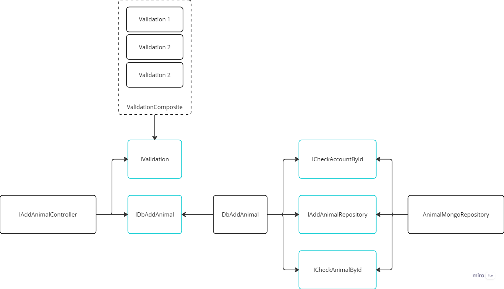

<h1 align="center">Rancho API</h1>

Esse repositório é o Backend do projeto "Rancho" criado para auxiliar no gerenciamento de gado de leite. [O frontend está disponível aqui](https://github.com/gustavohernandes11/rancho-web). O projeto está estruturado com uma arquitetura robusta seguindo padrões do Clean Architecture (usecases, divisão em camadas, isolamento das regras de negócio, etc).

## Exemplo

## Stack

-   Typescript.
-   Express.
-   Mongodb: banco de dados não relacional.
-   Jest: testes unitários.
-   Supertest: testes de integração.
-   JWT.
-   Bcrypt.
-   Husky: assegurar que o código não esteja falhando ao fazer commits.
-   Swagger: documentação.

## Funcionalidades

Versão 1.0.0 - Minimum Viable Product (MVP):

[x] Sistema de autenticação de usuários.

[x] Registrar lotes.

[x] Registrar animais com informações como sexo, nome, data de nascimento, código, lote, observação, etc.

[x] Separação dos animais por lotes.

## Próximas funcionalidades

[ ] Registrar medicamentos e vacinas dos animais.

[ ] Registrar produção de leite com relatórios estatísticos.

[ ] Gerar dados em Excel.

[ ] Gerar relatório do gado total divido em categorias para conformidade legislativas, como notas fiscais, vacinação e medicamentos.
